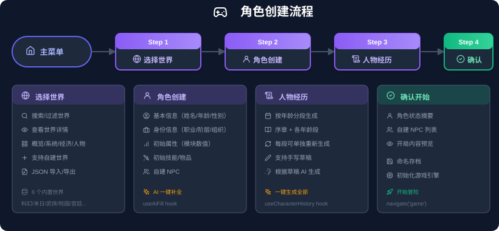
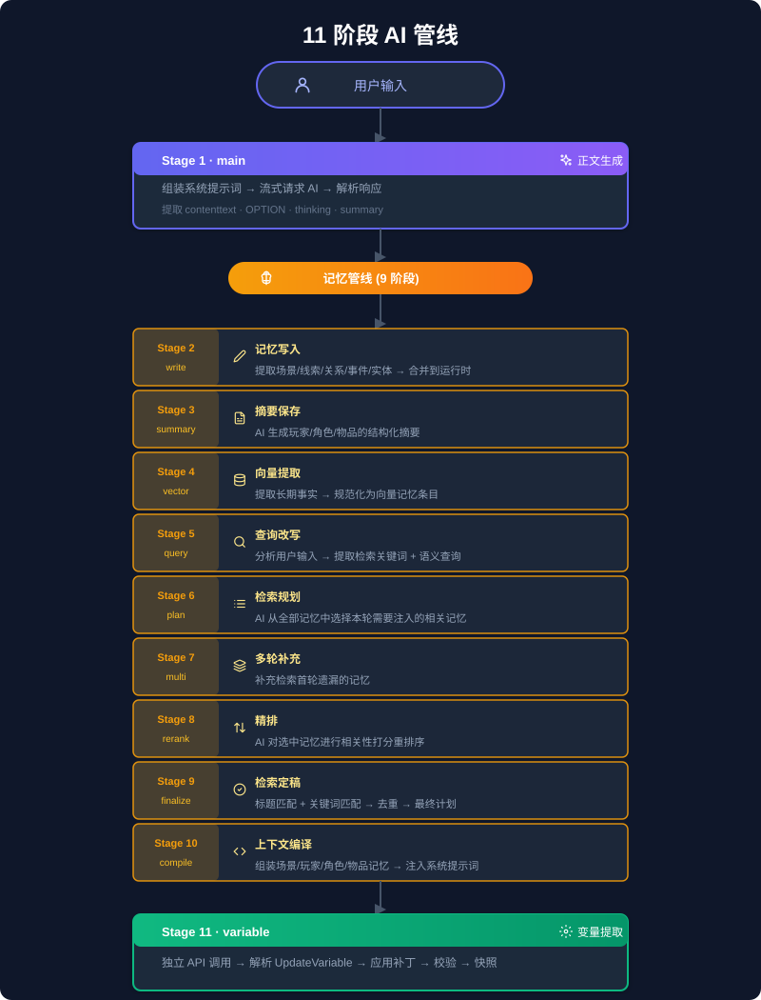
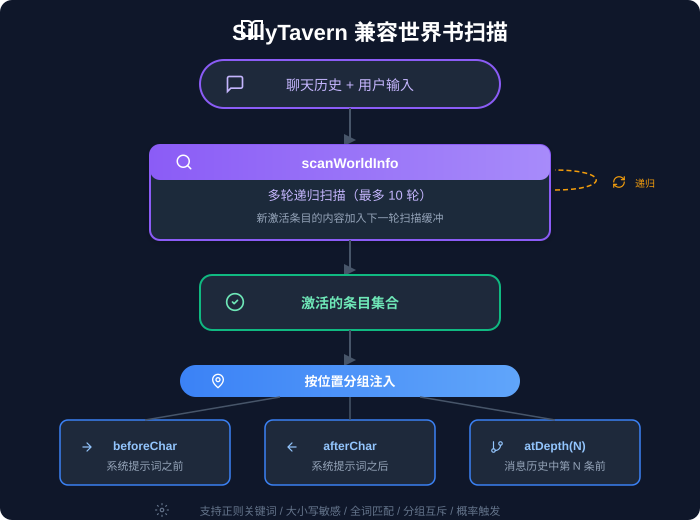

<div align="center">

#  世界漫游指南 · Omniplane Travels

**把任何脑洞编织成一个可以真正活进去的世界**

一个面向自定义世界、长期叙事与规则化模拟的 AI 互动叙事引擎。项目以 React + TypeScript 构建前端，以结构化游戏状态、叙事记忆、世界演化、事件工作流和可插拔模块共同驱动游戏。

[](https://react.dev/)
[](https://www.typescriptlang.org/)
[](https://bun.sh/)
[](https://zustand-demo.pmnd.rs/)
[](LICENSE)

`v2.7.6` · Web / PWA · Tauri 桌面端 · BYOK

</div>


##  项目能力

###  世界与角色

- 内置日式校园、烟火人间、武侠世界、末日废土、荒岛求生、边境贸易六个世界。
- 支持通过四阶段“世界编织仪式”从自然语言创建自定义世界。
- 世界定义覆盖地理、势力、文化、经济、人物、规则、系统与世界书。
- 四阶段角色创建流程将身份、天赋、经历与启程契约写入结构化角色状态。
- 自定义世界、角色与存档均可导入和导出。

###  叙事运行时

- 流式 AI 叙事与可交互选择卡片。
- 结构化 `GameState` 同步维护世界、玩家、NPC、资源和任务状态。
- 编译式叙事记忆保存场景锚点、故事线、关系、事件与长期事实。
- 世界演化引擎在对话之外推进资源、世界状态与后台事件。
- 动态任务、纪事系统、变量快照与历史回滚。

###  模块、事件与规则

- 数值属性、成长体系、生存资源、经营资产、骰子检定、天赋体系等可插拔模块。
- 自定义模块代理可根据世界需求生成和装配模块。
- 事件包由事件卡、规则、周期规则和世界书组成，可导入、导出和按局启用。
- 基于 React Flow 的类型化工作流编辑器与确定性规则解释器。
- AI 合集生成器可按世界生成事件、规则与世界书合集。

###  存储与跨端

- Web 端使用 IndexedDB 保存游戏存档、事件包与本地配置。
- 支持多存档、自动保存、快照回滚和 JSON 迁移。
- 可选云存档、创意工坊与邮箱验证码账号体系。
- 桌面端通过 Tauri 提供原生能力，移动端使用响应式面板与抽屉布局。

##  设计与流程图

| 世界编织与角色创建 | AI 叙事管线 |
|---|---|
|  |  |



##  技术架构

```text
React UI
├─ 开始界面 / 世界编织 / 角色创建 / 游戏界面
├─ 设置 / 事件典藏 / 自定义模块 / 存档空间
└─ 响应式桌面端与移动端布局
        │
        ▼
Zustand + React Context
├─ 配置、存档、事件、图像与账号状态
└─ 结构化 GameState / PlayerState / NPCData
        │
        ▼
Game Engine
├─ Prompt 组装与流式响应
├─ 变量更新与机械效果结算
├─ 叙事记忆与世界书注入
├─ 世界演化与事件规则求值
└─ 任务、纪事、卡片与快照
        │
        ▼
Storage / Services
├─ IndexedDB
├─ Tauri backend
└─ Cloudflare Workers + D1（可选云服务）
```

###  核心技术栈

| 层级 | 技术 |
|---|---|
| 前端 | React 19、TypeScript 6、Zustand |
| 服务 | Bun、Hono |
| 桌面端 | Tauri 2 |
| 存储 | IndexedDB、可选 Cloudflare D1 |
| 编辑器 | React Flow、Mermaid、Marked |
| 数据校验 | Zod |

###  关键目录

```text
src/
├─ api/                 AI Provider、图像生成与请求限流
├─ components/          React UI 组件
│  ├─ start/            首页、世界大厅、世界编织与角色创建
│  ├─ game/             游戏主界面、对话、选择卡片与侧栏
│  ├─ event/            事件典藏、卡片与规则工作流编辑器
│  ├─ workflow/         类型化工作流画布
│  ├─ card-workflow/    卡片内容编辑工作流
│  ├─ settings/         API、预设、记忆、变量与界面设置
│  └─ shared/           共享弹窗、图标、图谱与 UI 基础组件
├─ config/              存储键与运行配置
├─ constants/           运行时常量
├─ context/             游戏与 UI Context
├─ data/                内置世界、世界 Schema 与加载器
├─ engine/              Prompt、流式响应、变量与事件总线
├─ hooks/               游戏、向导、NPC、生图与响应式 Hooks
├─ memory/              编译式叙事记忆、向量检索与检查点
├─ modules/             属性、成长、生存、经营、骰子与天赋模块
├─ schema/              GameState / PlayerState / NPCData 类型
├─ simulation/          世界演化与机械层结算
├─ storage/             IndexedDB 存档与模板持久化
├─ stores/              Zustand 配置、存档、预设与生图 Store
├─ styles/ + theme/     Dawn V4 UI 与主题样式
├─ utils/               Markdown、Prompt、快照与安全工具
├─ worldbook/           SillyTavern 兼容世界书引擎
└─ worldgen/            选择式与自定义世界生成管线

src-tauri/              Tauri 桌面端 Rust 后端
functions/              Cloudflare Workers API 与边缘函数
migrations/             D1 数据库迁移
docs/                   架构、教程、规范、截图与变更记录
public/art/             世界、UI、图标与大厅视觉素材
```

##  本地运行

### 环境要求

- [Bun](https://bun.sh/)
- 一个 OpenAI 兼容 API；也支持 DeepSeek、Google AI 和自定义端点

### 安装与启动

```bash
git clone https://github.com/xuegao1416/Omni-plane-Travels.git
cd Omni-plane-Travels
bun install
bun run dev
```

开发服务默认运行在 `http://localhost:3456/`。

### 常用命令

| 命令 | 用途 |
|---|---|
| `bun run dev` | 启动本地开发服务 |
| `bun run build` | 构建 Web 版本 |
| `bun run typecheck` | TypeScript 静态检查 |
| `bun test` | 运行测试 |
| `bun run tauri:dev` | 启动 Tauri 开发环境 |
| `bun run tauri:build` | 构建桌面端 |

##  API 配置

启动应用后，在“设置”中填写：

1. API 端点；
2. API Key；
3. 模型名称；
4. 可选的温度、上下文长度、最大输出与代理地址。

API Key 使用 Web Crypto 加密后保存在本机。浏览器端遇到 Provider CORS 限制时，可使用自建代理；Tauri 桌面端可走原生 HTTP 链路。

##  数据与扩展格式

### 世界

- 内置世界：`src/data/worlds.json`
- 自定义世界：运行时保存并通过统一世界加载器读取
- 世界包含设定、人物、规则、模块、世界书和事件包关联

### 事件包

- `.opt-event` 为事件包导入导出格式
- 事件包可包含事件卡、规则、周期规则与世界书
- 全局启用状态与单局启用状态分离

### 世界书

- 支持 SillyTavern Lorebook 的关键词、正则、逻辑组合、概率、递归与去重机制
- 世界书可以来自世界定义、事件包和 NPC 档案

### 存档

- 游戏存档包含世界、角色、对话、变量、记忆、任务、纪事和模块运行时
- 支持自动保存、手动导入导出与历史快照回滚

##  安全与隐私

- API Key 仅保存在本机，不由项目服务器代管。
- Web 端使用 Web Crypto AES-GCM 与 non-extractable key。
- HTML 内容经过 DOMPurify 清理，嵌入内容运行在受限沙箱中。
- 变量路径和规则动作使用白名单与危险键检查。
- 云服务为可选能力，本地游戏不依赖项目账号。

##  文档

- [架构说明](docs/ARCHITECTURE.md)
- [上手教程](docs/tutorial.md)
- [变更日志](docs/CHANGELOG.md)
- [规则画布与工作流规范](docs/rule-canvas-workflow-spec.md)
- [记忆系统参考](docs/reference-memory-system.md)
- [内容政策](docs/content-policy.md)
- [项目治理](docs/governance.md)
- [隐私政策](PRIVACY.md)

##  致谢

本项目的编译式叙事记忆系统移植并适配自 [lucklyjkop/异界转生录](https://github.com/lucklyjkop/yijiekkk)，已获得原作者授权。原实现基于 Vue 3 与 Pinia，本项目将相关机制迁移为 React、TypeScript 与 Zustand 架构。

感谢原作者提供授权与技术资料。

##  License

[MIT](LICENSE)
