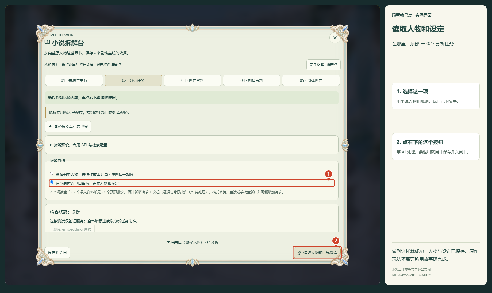
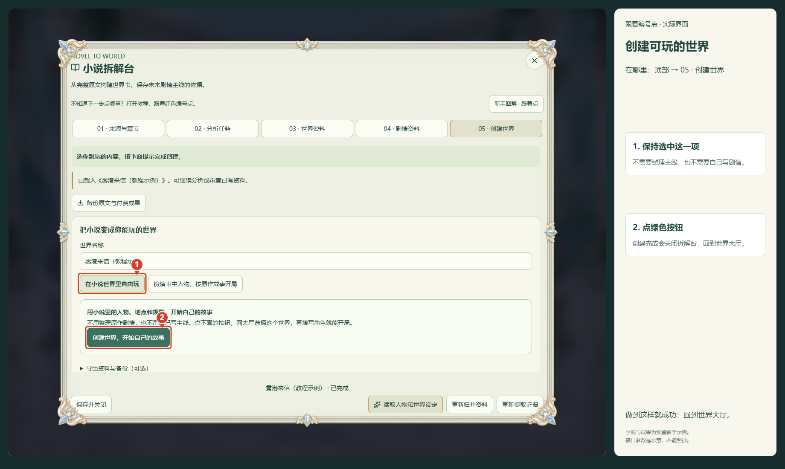
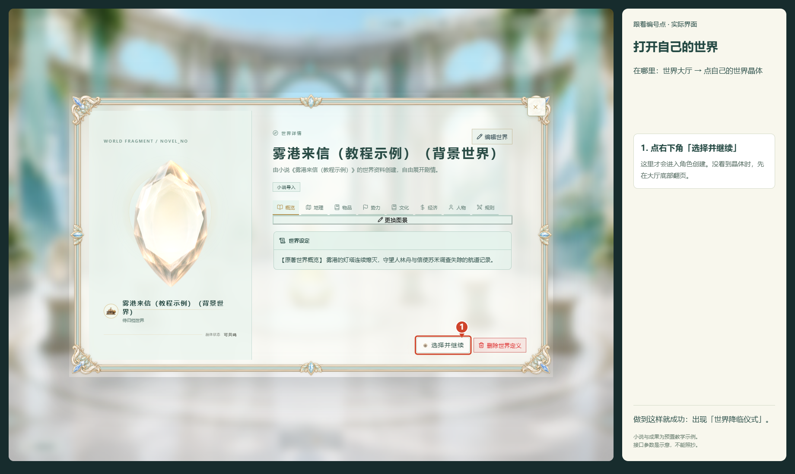
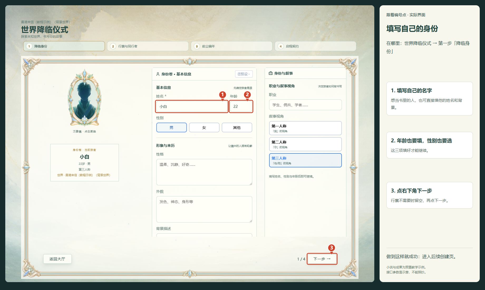
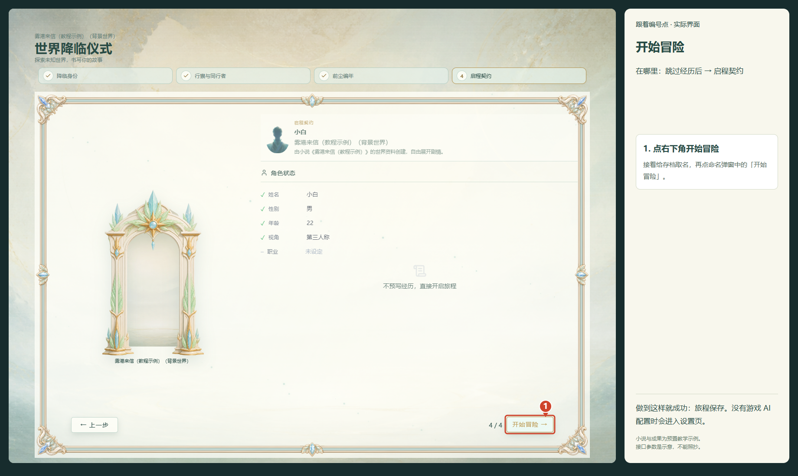

# 在小说世界里自由玩

用小说里的人物、地点和规则，开始自己的故事。不需要整理原作主线。

从世界大厅点「小说拆解台」。下面每一步都写了在哪里、点什么，以及成功后会看到什么。

## 第 1 步：上传你想玩的小说

**在哪里：** 小说拆解台顶部 →「01 · 来源与章节」

1. 点中间的「选择或拖入小说文件」，选你的 TXT 或 EPUB。
2. 上传后往下滑，看看正文能不能正常读。没有乱码就继续。

**做到这样就成功：** 页面出现章节数量和正文预览。

## 第 2 步：让拆解台连上你的 AI

**在哪里：** 顶部 →「02 · 分析任务」→ 展开「拆解预设、专用 API 与检索配置」

1. 已有游戏 AI：往下滑，点「复制游戏 API 配置」。没有配置过：填服务商给你的接口地址、密钥和模型。
2. 往下滑，先点「测试生成连接」，通过后点「保存专用配置」。其他设置先不改。

**做到这样就成功：** 页面提示「拆解专用配置已保存」。截图参数是示意，不能照抄。

向下滚动后的按钮位置：

## 第 3 步：让 AI 读取小说的人物和设定

**在哪里：** 顶部 →「02 · 分析任务」

1. 选择「在小说世界里自由玩 · 先读人物和设定」。
2. 点右下角「读取人物和世界设定」，然后等它处理。
3. 想暂时退出就点「保存并关闭」；回来在第一页选「继续已有资料」。

**做到这样就成功：** 看到世界资料已保存的提示，或者「03 · 世界资料」里已有内容。

## 第 4 步：确认小说人物和设定已经读出来

**在哪里：** 顶部 →「03 · 世界资料」

1. 看这里是否已经出现人物、地点、规则等文字。
2. 有资料就继续。没资料就回「02 · 分析任务」看进度或报错，先不要重新上传。

**做到这样就成功：** 页面显示「世界资料 · …条」，下面有实际内容。

## 第 5 步：把这些小说资料变成可玩的世界

**在哪里：** 顶部 →「05 · 创建世界」

1. 创建后拆解台会关闭，请保留本教程，继续下一步。
2. 保持「在小说世界里自由玩」，世界名称可以直接用默认值。
3. 点绿色按钮「创建世界，开始自己的故事」。

**做到这样就成功：** 拆解台关闭，回到世界大厅。

## 第 6 步：在大厅打开刚才创建的世界

**在哪里：** 世界大厅 → 点击名字带「背景世界」的晶体

1. 创建后一般自动翻到你的世界。没看到就用大厅底部箭头翻页。
2. 点自己的世界晶体，弹出详情后点右下角「选择并继续」。

**做到这样就成功：** 进入「世界降临仪式」，第一步是「降临身份」。

## 第 7 步：写好自己的角色身份

**在哪里：** 世界降临仪式 →「降临身份」

1. 填姓名、年龄，点选性别。想扮演书里的某个人，可以直接填他的姓名、性格和背景。
2. 点右下角「下一步」。行囊没想好可以不填，再点「下一步」。

**做到这样就成功：** 到「前尘编年」页面。

## 第 8 步：跳过经历，正式开始冒险

**在哪里：** 「前尘编年」→「启程契约」

1. 不想写以前的经历，就点右下角「跳过经历」。
2. 下一页点右下角「开始冒险」，给存档取名，再点弹窗里的「开始冒险」。

**做到这样就成功：** 旅程已创建。已配游戏 AI 时进入游戏；没有配置时进入设置页，继续下一步。

## 第 9 步：如果跳到设置页，补好游戏 AI

**在哪里：** 设置页左侧 →「API 设置」

1. 拆小说的 AI 和游戏聊天的 AI 要分别配置。跳到这里时，刚才的旅程已经保存。
2. 填你的接口地址、密钥和模型，往下滑测试连接，再点「保存配置」。
3. 回到游戏，在输入框发送：我环顾四周，先确认自己在哪里。已经配置游戏 AI 的玩家跳过这一步。

**做到这样就成功：** 进入游戏，可以在输入框发送自己的行动。

向下滚动后的按钮位置：

截图取自实际应用界面。小说与拆解成果是教学示例，接口参数是占位示意，不能照抄。教学验证没有发起付费 AI 请求。
