# 扮演书中人物，按原作故事开局

选择书里的人物，从原作的一段故事开始。AI 帮你整理剧情，不需要你重新写小说。

从世界大厅点「小说拆解台」。下面每一步都写了在哪里、点什么，以及成功后会看到什么。

## 第 1 步：上传你想玩的小说

**在哪里：** 小说拆解台顶部 →「01 · 来源与章节」

1. 点中间的「选择或拖入小说文件」，选你的 TXT 或 EPUB。
2. 上传后往下滑，看看正文能不能正常读。没有乱码就继续。

**做到这样就成功：** 页面出现章节数量和正文预览。

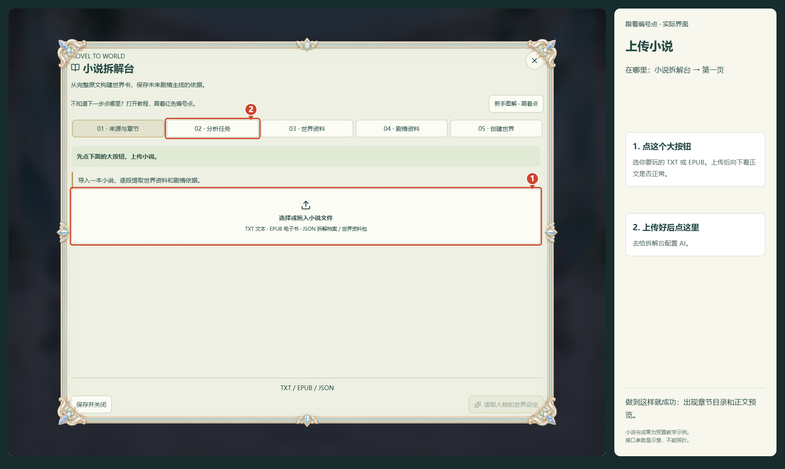

## 第 2 步：让拆解台连上你的 AI

**在哪里：** 顶部 →「02 · 分析任务」→ 展开「拆解预设、专用 API 与检索配置」

1. 已有游戏 AI：往下滑，点「复制游戏 API 配置」。没有配置过：填服务商给你的接口地址、密钥和模型。
2. 往下滑，先点「测试生成连接」，通过后点「保存专用配置」。其他设置先不改。

**做到这样就成功：** 页面提示「拆解专用配置已保存」。截图参数是示意，不能照抄。

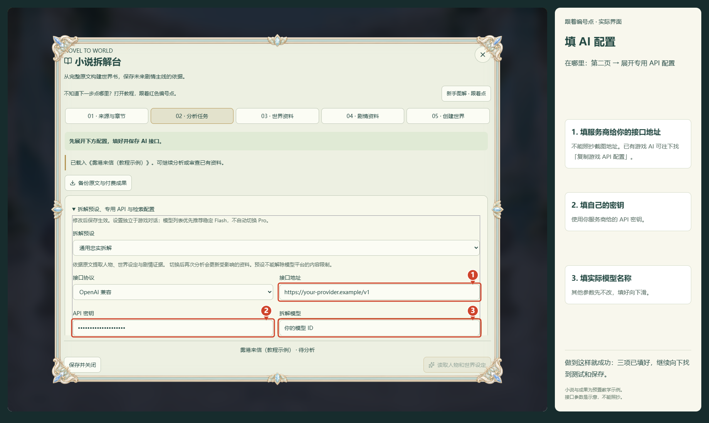

向下滚动后的按钮位置：

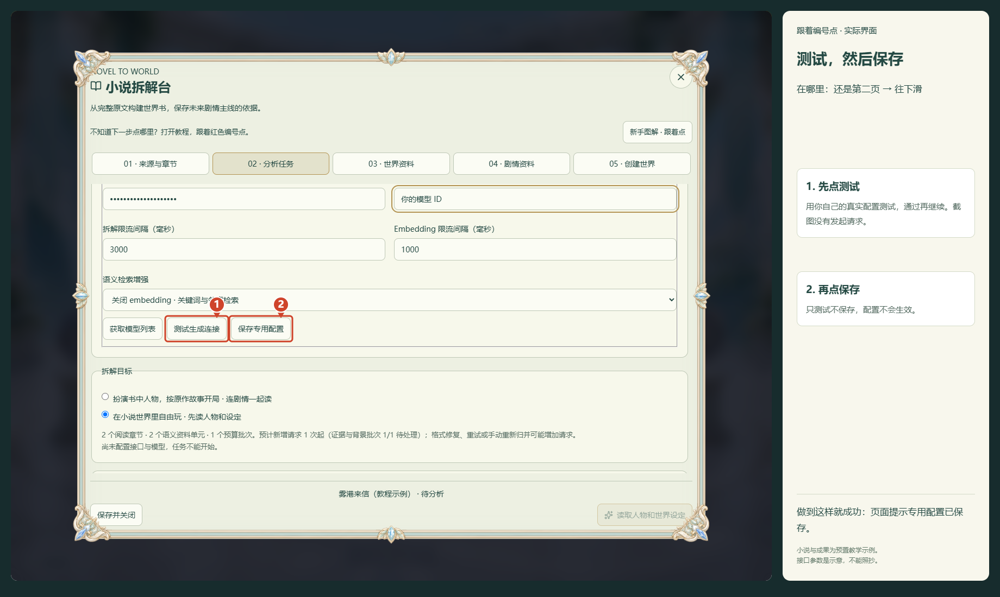

## 第 3 步：让 AI 连原作故事一起读

**在哪里：** 顶部 →「02 · 分析任务」

1. 选择「扮演书中人物，按原作故事开局 · 连剧情一起读」。
2. 点右下角「读取小说设定和原作故事」，然后等它处理。

**做到这样就成功：** 「03 · 世界资料」有内容；「04 · 剧情资料」里所需故事段显示完成。

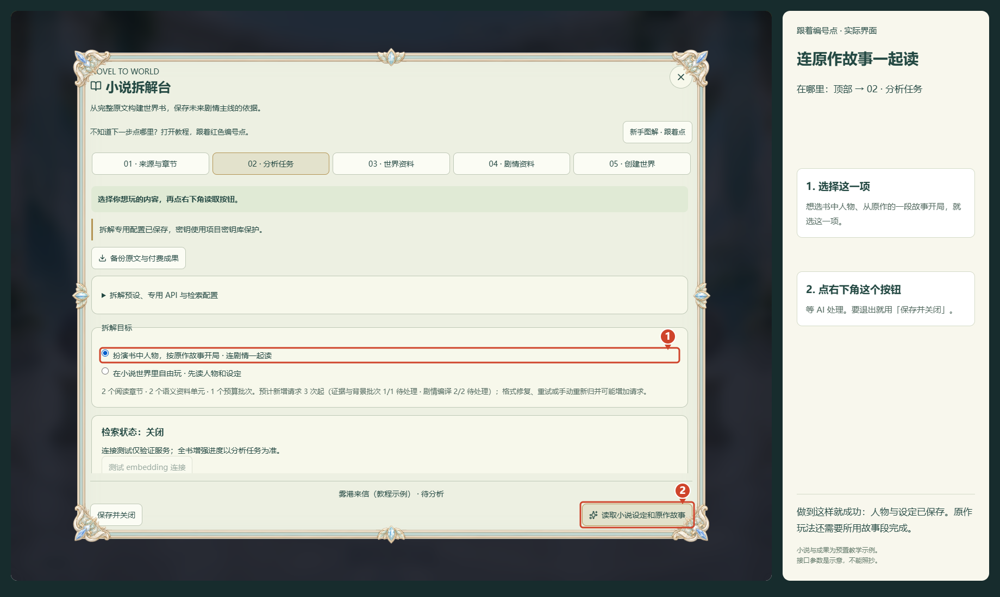

## 第 4 步：确认小说人物和设定已经读出来

**在哪里：** 顶部 →「03 · 世界资料」

1. 看这里是否已经出现人物、地点、规则等文字。
2. 有资料就继续。没资料就回「02 · 分析任务」看进度或报错，先不要重新上传。

**做到这样就成功：** 页面显示「世界资料 · …条」，下面有实际内容。

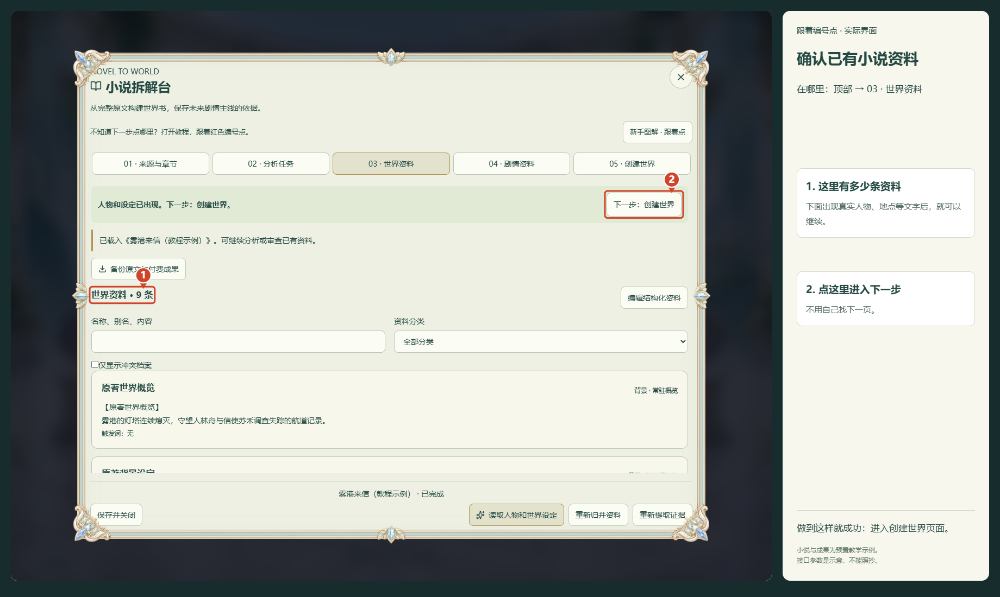

## 第 5 步：把已读出的故事整理成开局剧情

**在哪里：** 顶部 →「05 · 创建世界」→ 选「扮演书中人物，按原作故事开局」

1. 向下滑到「主线剧情」。现在它直接显示，已经不藏在折叠里。
2. 点「整理本世界小说剧情」，等整理完成。不用自己再写剧情。

**做到这样就成功：** 下面出现「AI 已整理出可用剧情」和「保存剧情版本并选用」按钮。

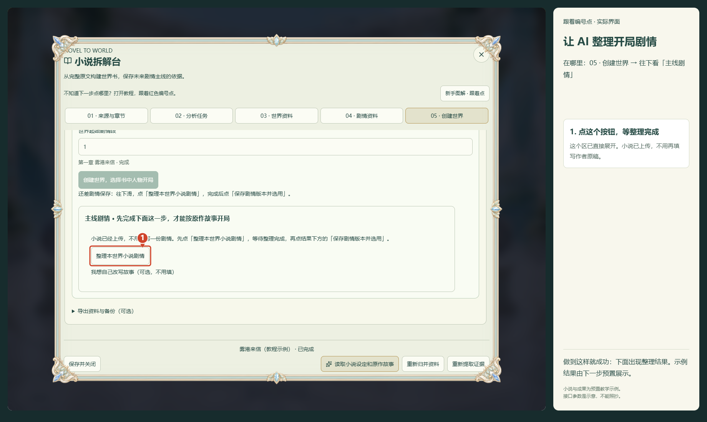

## 第 6 步：保存刚才整理好的剧情

**在哪里：** 还是「05 · 创建世界」→ 往下看到「AI 已整理出可用剧情」

1. 默认起始阶段可以直接用默认值。想换故事起点，再从下拉框选择。
2. 直接点「保存剧情版本并选用」。不用填写一大堆剧情字段；查看或修改细节是可选的。

**做到这样就成功：** 看到「剧情版本已保存，保存世界后用于新开局」。

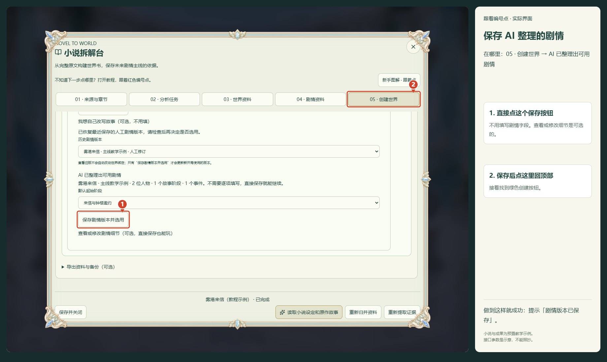

## 第 7 步：创建带原作故事的世界

**在哪里：** 点顶部「05 · 创建世界」回到本页顶部，再往下看到绿色按钮

1. 创建后拆解台会关闭，请保留本教程，继续下一步。
2. 如果起始故事段还没完成，先回「02 · 分析任务」继续读取；想换起点就在「世界起始剧情段」选择已完成的段。
3. 点绿色按钮「创建世界，选择书中人物开局」。

**做到这样就成功：** 拆解台关闭，回到世界大厅。

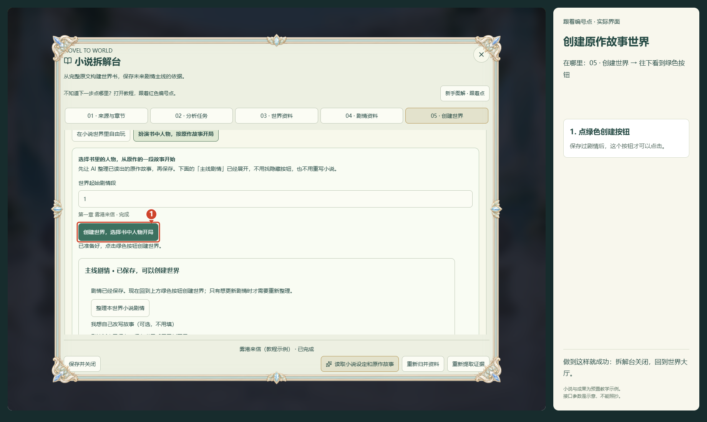

## 第 8 步：在大厅打开这个小说世界

**在哪里：** 世界大厅 → 点击名字带「小说世界」的晶体

1. 没看到自己的世界，就用大厅底部箭头翻页。
2. 点世界晶体，弹出详情后点右下角「选择并继续」。

**做到这样就成功：** 进入「世界降临仪式」。

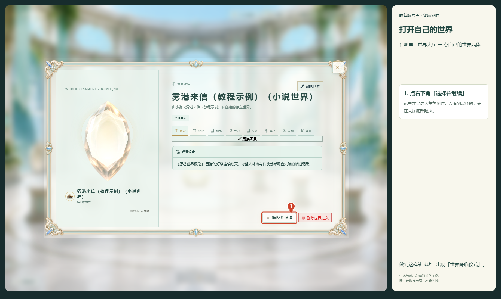

## 第 9 步：选择你想成为的书中人物

**在哪里：** 「降临身份」→ 页面里的「主线身份与起点」

1. 在「扮演身份」下拉框选人物；在「剧情起点」选从哪一段开始。
2. 补上年龄，点选性别，再点右下角「下一步」。行囊不需要时留空，继续点「下一步」。

**做到这样就成功：** 到「前尘编年」页面。

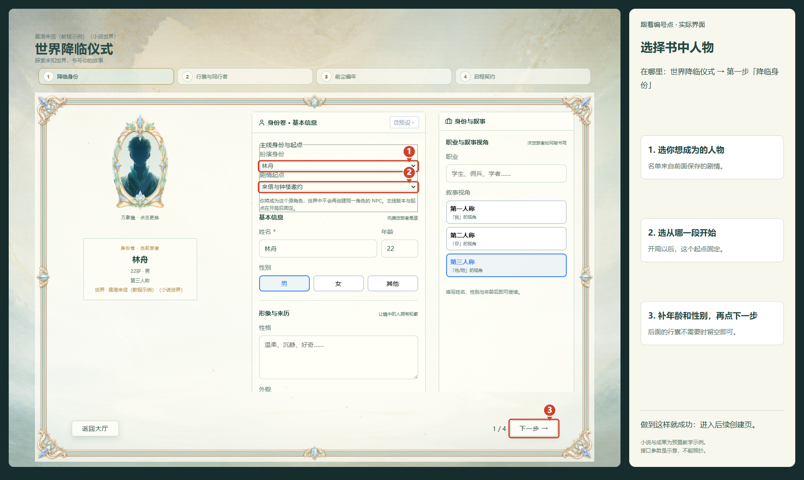

## 第 10 步：开始自己的这一次原作旅程

**在哪里：** 「前尘编年」→「启程契约」

1. 没想好以前的经历就点「跳过经历」。
2. 下一页点右下角「开始冒险」，给存档取名，再点弹窗里的「开始冒险」。

**做到这样就成功：** 旅程已创建。没配游戏 AI 时会跳到设置，继续下一步。

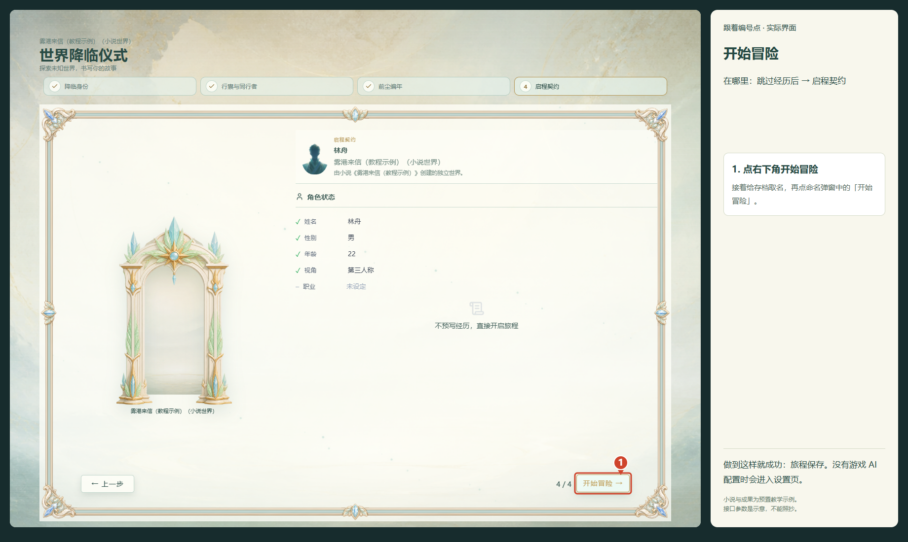

## 第 11 步：如果跳到设置页，补好游戏 AI

**在哪里：** 设置页左侧 →「API 设置」

1. 拆小说的 AI 和游戏聊天的 AI 要分别配置。跳到这里时，刚才的旅程已经保存。
2. 填你的接口地址、密钥和模型，往下滑测试连接，再点「保存配置」。
3. 回到游戏，在输入框发送：我环顾四周，先确认自己在哪里。已经配置游戏 AI 的玩家跳过这一步。

**做到这样就成功：** 进入游戏，可以在输入框发送自己的行动。

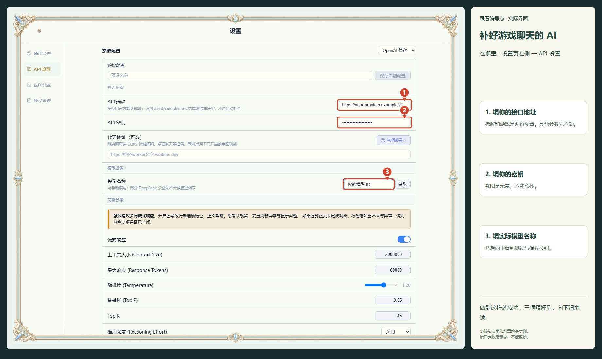

向下滚动后的按钮位置：

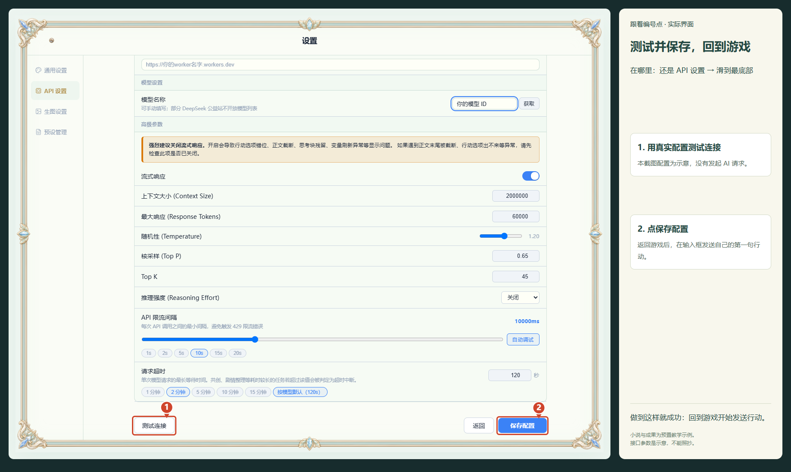

截图取自实际应用界面。小说与拆解成果是教学示例，接口参数是占位示意，不能照抄。教学验证没有发起付费 AI 请求。
